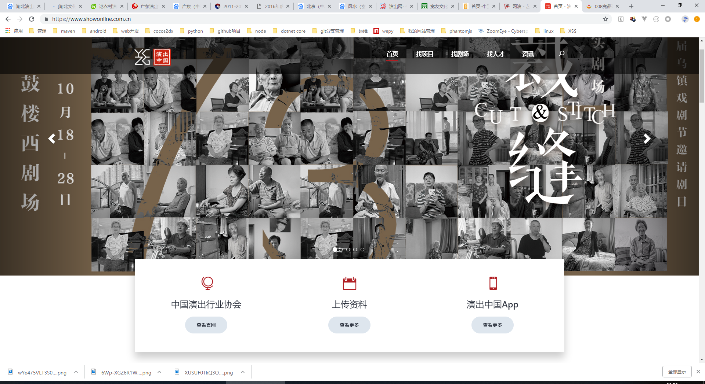

# 从一些个人的角度对竞品进行分析

先讲讲今天我们研究那几个竞品：[演出中国](https://www.showonline.com.cn/)、[网演中国](http://gd.wycn.com/index.php)、[牛至网](https://www.ovfun.com/)

还有这个两个“宽友小程序”(这个啥都没找到只有豆瓣小站[https://site.douban.com/234620/](https://site.douban.com/234620/))、[演艺中国](http://www.show160.com/)，给王乐留着，我水平不行能力有限

## 1.地理位置

俗话说：天时、地利、人和

这个地方风水是很重要的。

何谓“风水”，从古至今给风水下定义者不计其数，可历史上给风水最早下定义的为晋代的郭璞，在其名著《葬书》中有云：“葬者，乘生气也，气乘风则散，界水则止，古人聚之使不散，行之使有止，故谓之风水，风水之法，得水为上，藏风次之。”可见风水之术也即相地之术，核心即是人们对居住或者埋葬环境进行的选择和宇宙变化规律的处理，以达到趋吉避凶的目的。风水学又有阳宅和阴宅之分。

总之就是很重要

演出中国 | 网演中国 | 牛至网
---------|--------|---------
北京 | 广东 | 湖北

这几个地方都是好地方，先来说说北京

### 北京

北京，简称“京”，是中华人民共和国的首都、直辖市、国家中心城市、超大城市、国际大都市，全国政治中心、文化中心、国际交往中心、科技创新中心，是中国共产党中央委员会、中华人民共和国中央人民政府、全国人民代表大会、中国人民政治协商会议全国委员会、中华人民共和国中央军事委员会所在地，也是中部战区司令部驻地。

[2016年度北京市演出市场统计与分析](http://www.bjycxh.com/news/156.html)

总结一下：
- 整体市场：市场规模再次扩大，票房突破17亿
- 演出市场持续升温，票房收入增长逾一成
- 观众规模不断扩大，总人数增至1071.4万人次
- 观演群体培育成效明显，各类演出平均上座率均超60%

北京市场总体稳定向好，但是也没有爆发式增长。

让你们看看啥叫爆发式增长

中国电影票房：
- 2017年 559亿
- 2016年 457亿
- 2015年 440亿
- 2014年 296.39亿
- 2013年 217.69亿
- 2012年 170亿
- 2011年 131亿
- 2010年 101亿
- 2009年 62亿
- 2008年 43亿
- 2007年 33.27亿

去过北京的可以讲讲北京的文艺氛围。

### 广东

广东是岭南文化的重要传承地，在语言、风俗、生活习惯和历史文化等方面都有着独特风格。广东通行粤语、客家语和闽语，而且粤、客两大方言的中心都在广东。广东也是目前中国人口最多的省份。

讲讲艺术，岭南音乐因其文化的多样化具有多重属性，广东音乐、潮州音乐、客家音乐（客家山歌、广东汉乐）、雷州音乐和岭南的少数民族音乐 [106]  。广东音乐代表性人物有严老烈等，著名乐曲有《旱天雷》、《倒垂帘》、《饿马摇铃》、《雨打芭蕉》等。广州交响乐团、深圳交响乐团为中国一流乐团，广东实验现代舞团为国际知名舞团。粤语相声（南派相声）威震港澳，代表人物黄俊英。
标志性文化设施有广东省博物馆新馆、星海音乐厅、深圳音乐厅、东莞大剧院，东莞玉兰大剧院等；广东省连续两年获得中国社会文化最高奖“群星奖”评选总成绩和金奖数全国第一。

[广东演出市场收入占全国1/10](http://culture.people.com.cn/n1/2018/0118/c1013-29773771.html)

总结一下：广东的文艺演出业积淀深厚、开放包容、资源丰富、人才荟萃、市场规范、发展成熟，2017年全省演出市场收入和全省演艺设备行业出口总额分别占据全国10%和70％的市场份额。

### 湖北

[论农村演出市场的错位与失衡——湖北农村演出市场调查分析](http://www.docin.com/p-1616892058.html)

这篇文章主要讲了农村演出市场的矛盾

感觉这个湖北省政府还是不重视文化演出行业，基本找不到啥报导。

这个地理位置就不怎么好了。

综上：
+ 演出中国、网演中国在位置上来讲还是不错的
+ 牛至网就不行了

## 2.“颜值”

演出中国

网演中国

牛至网

我的直觉是：

1. 网演中国
2. 演出中国
3. 牛至网

评委老师给大家说一下原因啊

选择网演中国的原因：
1. 长的还可以
2. 目的性明确，一个搜索框，热门推荐，下面导航具体门类，找啥

网演中国和牛至网相较于演出中国内容还比较少，虽然演出中国的数据也不是真实用户，但是不至于显得单薄， 像个钓鱼网站。

## 研究一下演出中国上的数据

牛至网和网演中国这两个网站上的数据基本没啥研究的，屈指可数。网演中国主要的剧目和剧院都是两广的。牛至网主要转向教育，因为他们法人在北京注册了一家教育相关的公司。

// TODO: 爬取数据，分析
剧目：
剧目名称、剧目类型、巡演人数、价格、城市

剧场：
名称、价格、城市、座位

人才：
名称、年龄、所在城市、技能类型、毕业院校

分析：
每个城市每个剧目类型的 平均 价格、巡演人数

## 讨论周五晚上安排

## 我们产品的脑暴会(给大家发挥的)
1. 关于用户的促活积累
2. 总结北京、上海两次会议，行业的痛点
3. 行业大佬背书
4. 产品大的方向

## 心灵之旅
[【背包】回顾金庸大师的一生！刀剑江湖今封笔，颠沛流离半生缘。](https://www.bilibili.com/video/av34972926?spm_id_from=888.3039.Md_NqkLFPNz.2)
[缅怀金庸先生: 在光影中与一个时代挥手作别](https://www.bilibili.com/video/av34984285?from=search&seid=1825448452181661348)

